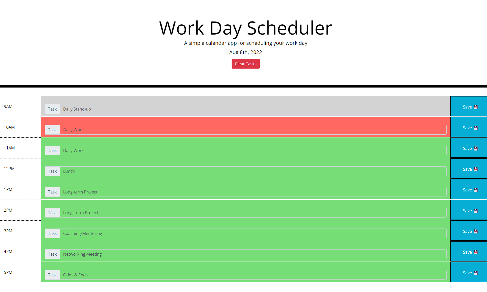

# Today’s Work Schedule

We all know that your average workday can be jam-packed at times. It’s hard to make time for daily tasks, long-term projects, meetings, networking, and let’s not forget lunch! That’s why it’s vital that you have the ability to plan out your day with this work scheduler web app.

Take a look at this screenshot for an example of what an organized workday looks like:

## Entering a task

Tasks can be entered for any corresponding time-block by clicking on the input field next to the “Task” label. Type in the description of your task and make sure that you save your task with the blue button on the right. This will save your task even if you leave the page. You can also edit your tasks just as easily by following the same steps.

## Color-coding

Each hour is color coded in relation to the current hour. If the block is gray, then that hour has passed. If it’s green, it’s still an upcoming event. If it’s red, that task or event is happening right now! Get a move on!

## Clear Tasks

Once you’re done with your day you can clear your tasks with the “Clear Tasks” button above the scheduling grid. This will clear your tasks and reload the page.

### Get Organized Now!

[Access your own personal scheduler here](https://littmarque27.github.io/todays-work-schedule/)
